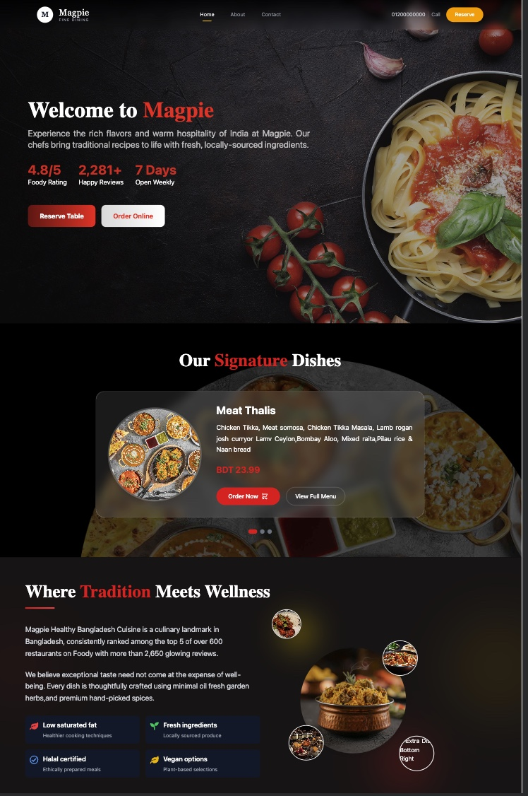

# Magpie — Restaurant Website

A restaurant website built for Magpie Fine Dining, an Indian restaurant concept. Built with React, Vite, and Tailwind CSS.

## Preview



The homepage covers the hero section with reservation/order buttons, a signature dishes carousel, and a "tradition meets wellness" section highlighting things like halal certification and vegan options.

**Live Demo:** _add your deployed link here once it's up_

## What's in it

- Hero section with ratings, reviews count, and CTA buttons (Reserve Table / Order Online)
- Signature dishes showcase with pricing and "Order Now" / "View Full Menu" actions
- A section on ingredients and dietary info (low saturated fat, fresh ingredients, halal certified, vegan options)
- Smooth page animations
- Responsive layout, works fine on mobile

## Stack

- React 19
- Vite for the dev server and build
- Tailwind CSS for styling
- Firebase (for auth/data, if you're wiring up ordering or reservations)
- Framer Motion for the animations
- React Router for page navigation
- React Toastify for notifications

## Running it locally

You'll need Node.js installed. Then:

```bash
git clone https://github.com/your-username/restaurantwebsite.git
cd restaurantwebsite
npm install
npm run dev
```

It'll be up at `http://localhost:5173`.

When you're ready to ship it:

```bash
npm run build
npm run preview
```

And if you want to check for lint issues:

```bash
npm run lint
```

## Project layout

```
restaurantwebsite/
├── public/
├── src/
│   ├── main.jsx
│   └── ...
├── index.html
├── vite.config.js
├── package.json
└── README.md
```

## Notes

- Vite config lives in `vite.config.js`
- ESLint uses the newer flat config format, see `eslint.config.js`
- Tailwind v4 is set up through its official Vite plugin, no separate config file needed

## Contributing

Feel free to fork this, open issues, or send a PR if you spot something worth fixing.

## License

MIT
